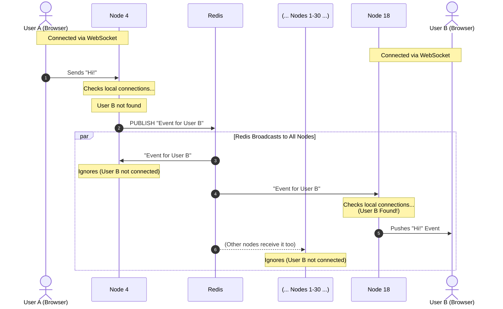

Imagine you have a chat app in production, with 30 nodes (servers), and a load balancer.

Each of your 30 nodes run their own instance of the backend, and you have a load balancer.

Now, imagine you have two users, **User A** and **User B**, who are in a DM with each other.

**User A** loads your chat app in their browser. A WebSocket connection is established between **User A** and a random available node (picked by the load balancer) - in this case, **Node 4**. **User A** sends a message: "Hi!".

The message travels from **User A**'s browser, through the websocket, to **Node 4**.

**Node 4** then receives the message and stores it in the database. However, it also *emits an event* to **User B**.

**Node 4** checks all the users connected to it, and checks if **User B** is connected. Now, 29 times out of 30, **User B** will be connected to a different node than **User A**. And in this case, **User B** is actually connected to **Node 18**. But **Node 4** doesn't know that. So **Node 4** uses the Redis Pub/Sub mechanism to publish an event: "Send this <event> to <**User B**>".

Once this event has been sent, all 30 of your nodes receive the message. All 30 of them check whether **User B** is connected to them or not. Most of them see **User B** is not connected, and ignore the message. But **Node 18** sees **User B** connected. So, **Node 18** finds the connected websocket to **User B**, and broadcasts the <event>.

**User B**'s browser picks up the event, and displays the message sent. This all happens in under a second (and the largest part of the delay is the IO between **User A** and **User B**'s network, not Redis).

Now, scale this to **User B** being logged in on their phone, tablet, and laptop. The phone is connected to **Node 4**, the tablet to **Node 9**, and the laptop to **Node 18**.

When **User A** sends another message, **Node 4** immediately picks up the **User B** connected to its own node, and broadcasts the message to the phone. It then broadcasts the message via Redis, and **Nodes 9 & 18** receive the message (the others ignore it). From here, **Nodes 9 & 18** both see they have an active connection to **User B**, and broadcast the message. Now, **User B**'s tablet and laptop also receive the message instantly.

What about a group chat? Imagine Users **C** and **D** join. When **User A** sends a message, the backend now sends the <event> to <**User B** & **User C** & **User D**>. The flow is the same. The message gets sent out via Redis, and this time the servers check if they have **B**, **C**, or **D** connected. If so, they send the event over the transport.